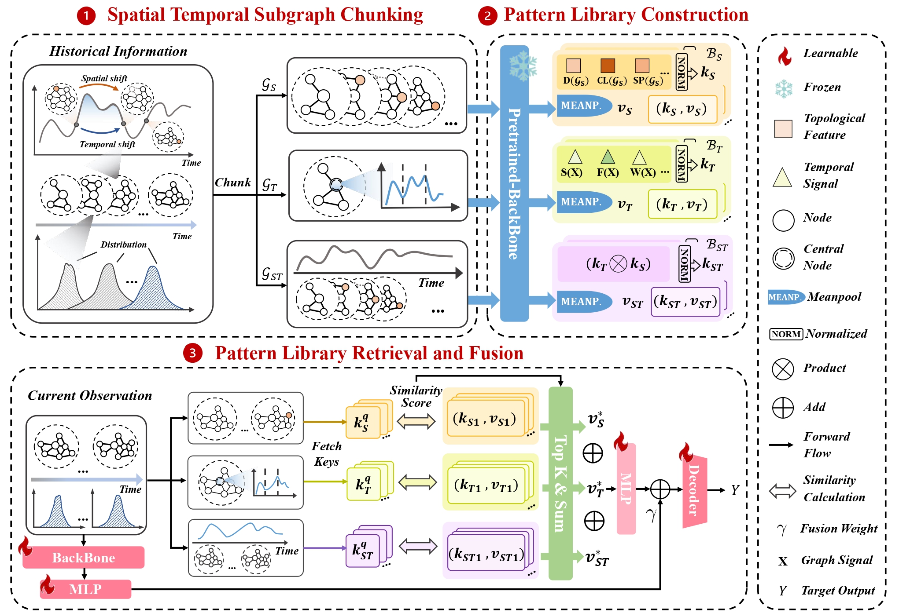

# <div align="center">STRAP: Spatio-Temporal Pattern Retrieval for Out-of-Distribution Generalization</div>

<div align="center">

[](https://opensource.org/licenses/Apache-2.0)
[](https://www.python.org/)
[](https://pytorch.org/)
[](https://arxiv.org/abs/2505.19547/)
[](https://github.com/HoweyZ/STRAP)

[📄 Paper](https://arxiv.org/abs/2505.19547) | [📊 Datasets](https://drive.google.com/drive/folders/1OiMLuFBdc56CLekileRjH0xyhDWuoC6C)

</div>

---

## 📋 Table of Contents

- [✨ Overview](#-overview)
- [🏗️ Repository Structure](#️-repository-structure)
- [🚀 Getting Started](#-getting-started)
- [🙏 Acknowledgements](#-acknowledgements)
- [📝 Citation](#-citation)
- [🌟 Star History](#-star-history)

---

## ✨ Overview

Spatio-Temporal Graph Neural Networks (STGNNs) have emerged as a powerful tool for modeling dynamic graph-structured data across diverse domains. However, they often fail to generalize in Spatio-Temporal Out-of-Distribution (STOOD) scenarios, where both temporal dynamics and spatial structures evolve beyond the training distribution. To address this problem, we propose STRAP, which enhances model generalization by integrating retrieval-augmented learning into the STGNN continue learning pipeline. Extensive experiments across multiple real-world streaming graph datasets show that \methodname consistently outperforms state-of-the-art STGNN baselines on STOOD tasks, demonstrating its robustness, adaptability, and strong generalization capability without task-specific fine-tuning.
<div align="center">
  
  <p><em>STRAP Framework Architecture</em></p>
</div>


---

## 🏗️ Repository Structure
```
STRAP/
│
├── 📄 README.md                    # Project documentation
├── 📄 LICENSE                      # Apache 2.0 License
├── 📄 environment.yaml             # Conda environment configuration
├── 🚀 main.py                      # Main entry point for experiments
├── 🚀 stkec_main.py               # STKEC experiments entry point
├── 📜 run.sh                       # Batch experiment execution script
│
├── 📁 conf/                        # ⚙️ Configuration files
│   ├── AIR/                       # Air quality dataset configs
│   ├── ENERGY-Wind/               # Wind energy dataset configs
│   └── PEMS/                      # Traffic dataset configs
│       ├── strap.json
│       ├── ewc.json
│       └── ...
│
├── 📁 src/                         # 💻 Source code
│   ├── dataer/                    # Data loading and preprocessing
│   │   ├── ...
│   │
│   ├── model/                     # Model implementations
│   │   ├── ...             # Model components
│   │
│   └── trainer/                   # Training and evaluation
│       ├── ...
│
├── 📁 utils/                       # 🛠️ Utility functions
│   ├── ...
│
├── 📁 font/                        # Font files for visualization
├── 📁 log/                         # 📊 Training logs and checkpoints
└── 📁 data/                        # 💾 Dataset storage (create this)
```
---

## 🚀 Getting Started

### 📋 Prerequisites

Before you begin, ensure you have the following installed:

- **Conda** or **Miniconda** ([Download](https://www.anaconda.com/products/distribution))
- **NVIDIA GPU** with CUDA support (recommended)
- **Python 3.8+**

### 💻 Usage

```bash
# ENERGY-Wind, the same for other datasets.
bash run.sh
```

---

## Runtime and validation

The active retrieval implementation is `src/model/STRAP.py`. Models import it
from `src/model/model.py`; prediction and STKEC trainers share
`src/trainer/engine.py`.

- STRAP keys and values are device buffers. Projection, cosine search, top-k and
  weighted retrieval stay on the model device. Pattern files use CPU tensors;
  transfers happen when saving or loading a year, not per forward pass.
- `retrieval_batch_size` (default 1024) limits the temporary query-by-library
  similarity matrix. `max_patterns` defaults to 2048 and `k_neighbors` to 16.
  These optional JSON settings must be positive. Chunking preserves exact top-k
  retrieval and gradients; it does not select a different retrieval algorithm.
- PECPM history and drift histograms stay on the device. Detection returns only
  the node-score vector to the CPU graph-selection code.
- Validation uses tensor metrics. Test metrics accumulate per-horizon sums
  instead of keeping all predictions. Only final metric summaries and epoch
  losses cross to the CPU for reporting. Dataset batches still enter from host
  memory; pinning and non-blocking copies are enabled for CUDA. `num_workers`
  is configurable in JSON and defaults to 0 for the shared trainer.

Select CUDA with `--gpuid N`, or select CPU explicitly with `--gpuid -1`.
Unavailable CUDA devices, invalid backbone names and retrieval errors raise
errors. Evaluation requires the pattern library for the selected year; it does
not create patterns from validation/test data or silently skip STRAP.

The fixed input projection is initialized in the constructor and is stored as
`strap.projector.weight` in RAP checkpoints. Existing checkpoints containing
that key load strictly. Older checkpoints without it must be recreated by
training with the current code; keys are never silently added or discarded.
Yearly pattern `.pkl` files from the integrated implementation retain their
format. Standalone tensor queries must have `gcn.hidden_channel` features; RAP
performs the learned adaptation before querying.

Training also corrects three pre-existing issues: validation now uses eval
mode, STKEC clustering labels use cluster indices and retain gradients, and
checkpoint filenames are compared by numeric loss. These corrections can
change training trajectories. Constant feature distributions have zero drift
when compared with themselves.

Run the regression suite with the dependencies from `environment.yaml`:

```bash
OMP_NUM_THREADS=1 MKL_NUM_THREADS=1 python -m unittest discover -s tests -v
```

The tests cover retrieval values and gradients, pattern/checkpoint lifecycles,
streamed metrics against NumPy, drift scores against SciPy, auxiliary-loss
gradients, and two-year/incremental training. The CUDA residency and transfer
profiler test runs only when CUDA is available; a skipped CUDA test is not a
GPU performance measurement. Full dataset accuracy and throughput require the
external datasets and a CUDA machine.

---

## 🙏 Acknowledgements

We would like to express our gratitude to:

- **EAC**: We thank the authors for their excellent work. Our implementation builds upon their codebase: [EAC Repository](https://github.com/Onedean/EAC)

---

## 📝 Citation

If you find this work useful for your research, please consider citing our paper:

```bibtex
@article{zhang2025strap,
  title={STRAP: Spatio-Temporal Pattern Retrieval for Out-of-Distribution Generalization},
  author={Zhang, Haoyu and Zhang, Wentao and Miao, Hao and Jiang, Xinke and Fang, Yuchen and Zhang, Yifan},
  journal={arXiv preprint arXiv:2505.19547},
  year={2025}
}
```
---

## 🌟 Star History

[](https://www.star-history.com/#HoweyZ/STRAP&type=date&legend=top-left)

---


